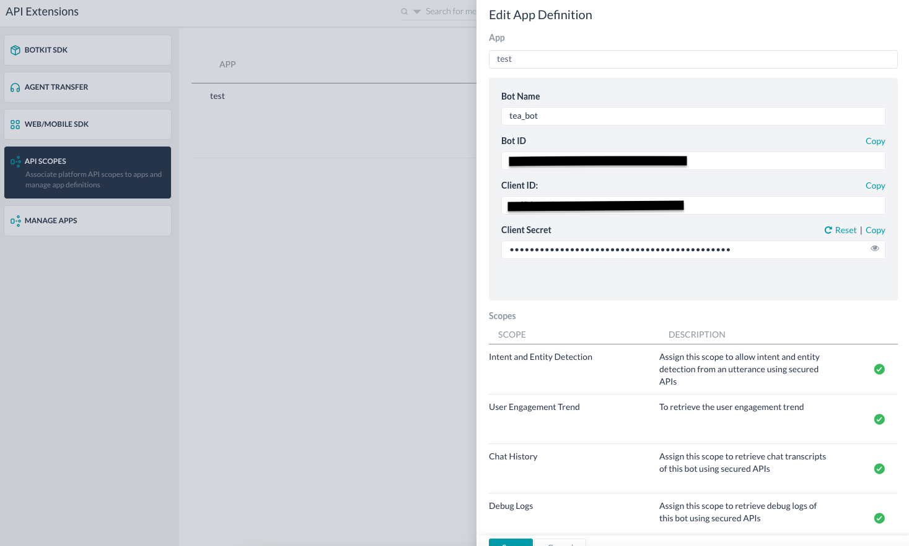
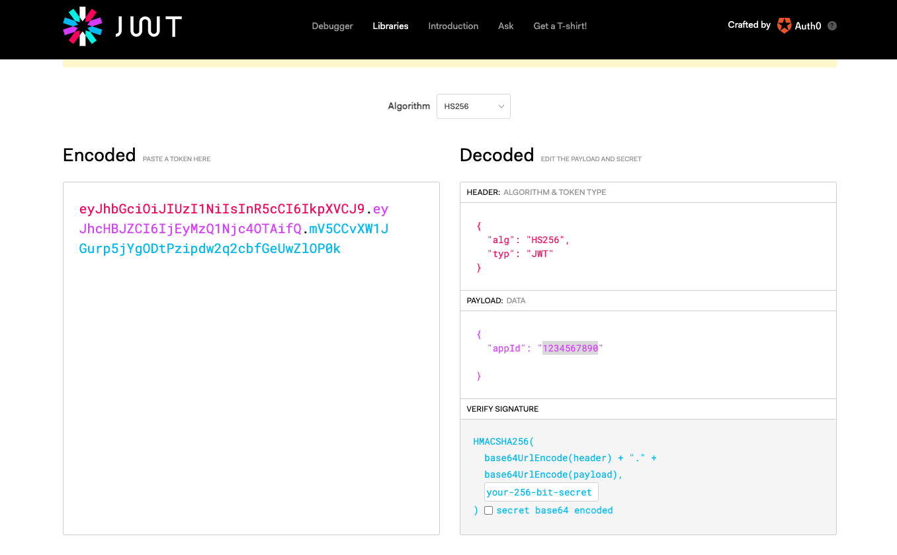

### Knowledge graph FAQ Utility.

#### Overview

In this script, we append a new FAQ to the existing graph without disturbing the current structure of the Knowledge Graph. We also generate-graph level, edit or delete a question, rebuild a KG and create report.


#### Addition of New FAQ

A new FAQ is added under the knowledge graph under two conditions when the FAQ is matched with the existing FAQ question in the knowledge graph. The new FAQ is appended under the same path. we consider FAQ score as the metrics to decide whether a new FAQ should be added under the same path.

Or, the script generates the terms and tag for the new FAQ and append it under the root node.

#### Edit Question/Delete Question

The user can perform the task of addition and deletion before adding into the KG graph.

#### Adding Synonyms
The script also adds grobal gragh sysnonms into new output json. To run this feature you need to feed *generated_synonyms.csv* which is generated using  synonyms generator below are the details.

#### Prerequisites

------------
- **Python 3.7 and above**: requires python 3.7. Can be downloaded from here: https://www.python.org/downloads/

- **Synonym generator(Optional)** : It is advised to use Synonym generator output csv file of synonyms. it is add-on tool developed to help the bot developer derive synonyms for the nodes in the KG https://github.com/Koredotcom/KnowledgeGraphGenerator


#### Configuration Steps

------------
**config.json**: 

**Note: add your bot api app information here**

- This file contains the information regarding the bot configuration for the calling the intend api. **{bot_id, auth_token}**

**Create an app from API Extensions and provide Scope to the APP to access the KG** 




**Generate the auth_token for JWT**




**Important NOTE**:Add these param in the config.json file


**requriement.txt**: 
- contains all the need details to run the script

**Configuring KnowledgeGraph Util**

**Step 1:** Download the KG_updated from GitHub : Find the repository here: 

**Step 2:** 

**Create a virtual environment as evnv_KG**
    

    python3 -m venv evnv_KG

**Activate the virtual environment**

    source evnv_KG/bin/activate
	
Once the virtual environemnt is activated, you should see virtual environment name at the start of every command in the console.

**Step 3:** Install requirements for the project: Run the following command from your project root directory (KnowledgeGraphGenerator) to install requirements

    pip install -r requirements.txt

**Run**
  

        pip list
command to verify is all the installed requirements


#### Running the script

------------


#### Linux/MAC  

#### json Commands

**usage for Adding new FAQ**

    python KG_util.py --file_path 'input -  Knowledge Collection.json'  --operation 'add' --newFaqFile 'sampleNewQuestion.json '

**usage for Adding Editing FAQ**

    python KG_util.py --file_path  'input -  Knowledge Collection.json' --operation 'edit' 

**usage for Adding deleting FAQ**

    python KG_util.py --file_path 'input -  Knowledge Collection.json'   --operation 'delete' 

------------


#### CSV Commands

**usage for Adding new FAQ**

    python KG_util.py --file_path 'input -  Knowledge Collection.csv'  --operation 'add' --newFaqFile 'sampleNewQuestion.json '

**usage for Adding Editing FAQ**

    python KG_util.py --file_path  'input -  Knowledge Collection.csv' --operation 'edit' 

**usage for Adding deleting FAQ**

    python KG_util.py --file_path 'input -  Knowledge Collection.csv'   --operation 'delete' 


#### Command Options

------------t 


**Note: : The options which are listed as mandatory should be given along with command, for options which are regarded as optional, the default values mentioned will be picked**

| Option name  |Description |Type| Mandatory / Optiona  | Default value  |
| :------------ | :------------ | :------------ | :------------ |:------------ |
| --file_path  |  Input KG file location  |JSON or CSV|  Mandatory  |   |
|--operation   | The type operation  |add/edit/delete| Mandatory   |   add|
| --newFaqFile  | The input file containning new FAQ for addition |JSON or CSV  | Mandatory  |   |
| --synonyms_file_path |  synonyms csv file that is generated using SG generator|  | Optional  | false  |

------------


**Option: file_path**
Type specifies the type of input file. Currently only three formats are supported and those are listed below:


1. **json** 
- You can generate input in this format from kore.ai bot builder tool by exporting KnowledgeCollection and selecting JSON format for export

2. **csv**-
You can generate input int this format from kore.ai bot builder tool by exporting KnowledgeCollection and selecting CSV format for export

**Option: operation**

1. **add** - to add new question into the KG graph.
1. **edit** -  edit a existing question from KG
1. **delete**- delete a existing question from the KG

**option: newFaqFile**

The file contains list of question and answer need to add into KG, this file can be json or csv:
Below is the sample for **JSON Format**

```json
{
  "faq": [
    {
      "question": "Give me list of holidays in this year",
      "answer": "Here are the list of holidays in this year"
    },
    {
      "question": "How to raise a ticket with for laptop replacement",
      "answer": "Please follow this specific steps to raise a ticket "
    }
  ]
}
```
Below is the sample for **CSV Format**


|  Sr.no |  question |  answer|
| ------------ | ------------ | ------------ |
| 1  | "Give me list of holidays in this year"  |"Here are the list of holidays in this year"   |
| 2  | "How to raise a ticket with for laptop replacement"  | Please follow this specific steps to raise a ticket "  |


#### Output details

#### json

Output JSON file generated can be located under project root directory with name of file as **output_file.json**

The output JSON file can be **directly imported to KnowledgeCollection in bot**as json format

#### csv

Output CSV file generated can be located under project root directory with name of file as **output_file.csv**

The output CSV file can be **directly imported to KnowledgeCollection in bot**as json format


------------


#### Using Synonym Generator

Synonym generator is an add-on tool developed to help the bot developer derive synonyms for the nodes in the KG. For this, one need to follow the following basic steps:

for more details into [Synonym Generator](https://github.com/Koredotcom/KnowledgeGraphGenerator "Synonym Generator")

**Example Usage**
The following is an example of how the synonym generator is to be used:

 ```python
  python synonym_generator/synonym_generator.py  --file_path output_file.json
```


#### output details

The output of the file is saved as **generated_synonyms.csv**


#### Using generated synonym file with KG generator

Use following command to run KG_util with generated synonyms file.
```python
python KG_util.py --file_path 'input -  Knowledge Collection.json'  --operation 'add' --newFaqFile 'sampleNewQuestion.json ' --synonyms_file_path 'generated_synonyms.csv'
```

------------


#### Generating Report

 it run all the dianostics on the graph and generate a CSV report.

**Example Usage**
The following is an example of how the Generating Report is to be used:

    python generateCSV_report.py --file_path 'input_json_file'

#### Output details

Output JSON file generated can be located under project root directory with name of file as **csvreport.csv**

------------
#### Mutating the Graph/KnowledgeGraphGenerator

Running graph in mutating mode which corrects the existing graph by overriding existing graph completely.

for more details into [KnowledgeGraphGenerator](https://github.com/Koredotcom/KnowledgeGraphGenerator "Synonym Generator")


**Example Usage**
The following is an example of how the KG generator is to be used:

    python KnowledgeGraphGenerator.py --file_path 'INPUT_FILE_PATH' --type 'INPUT_TYPE' --language 'LANGUAGE_CODE' --v true

#### Output details

Output JSON file generated can be located under project root directory with name of file as **ao_output.json**

The output JSON file can be directly imported to KnowledgeCollection in bot as json format


------------


#### LOGS/Backup of Input KG

**Logs**
All the logs related to KG utility can be found under log folder in **auto_kg.log** file

**Backup**
The backup of the input KG graph is store for each day under the **backup floder** for each day in case the user corrupts the graph.


